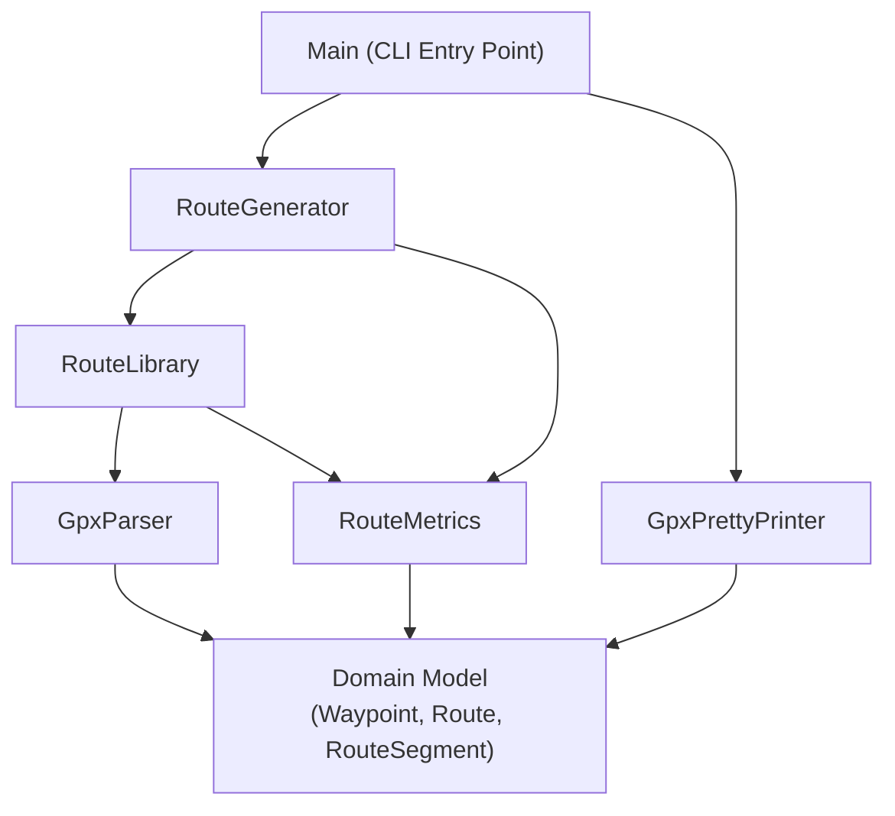
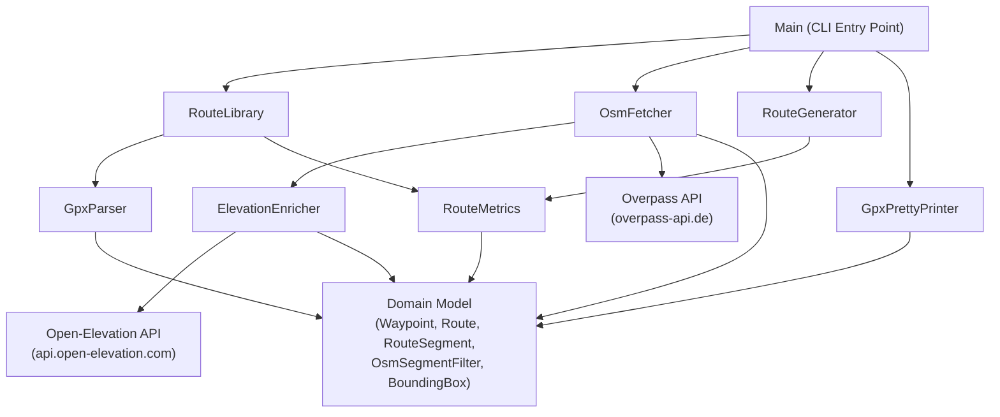

# Design Document: GPX Route Generator

## Overview

The GPX Route Generator is a Java command-line application that synthesizes new trail running routes by composing segments from a library of existing GPX files. Given a target distance and elevation gain, it selects and concatenates geographically adjacent segments from the library to produce a valid GPX output file whose metrics fall within the specified tolerances.

The application is structured around four primary concerns: parsing GPX XML into an internal model, computing route metrics (distance and elevation), generating a route by selecting segments via a backtracking search, and serializing the result back to GPX. These concerns map directly to four components: `GpxParser`, `RouteMetrics`, `RouteGenerator`, and `GpxPrettyPrinter`.

**Key design decisions:**

- **StAX for XML parsing and writing**: Java's built-in StAX (`javax.xml.stream`) API is used for both reading and writing GPX files. It is streaming, memory-efficient, requires no external dependencies, and is well-suited to GPX's shallow, sequential structure. DOM would load the entire file into memory unnecessarily; SAX is callback-driven and harder to reason about.
- **Immutable value objects**: `Waypoint` and `Route` are immutable records. This makes them safe to share across components and simplifies testing.
- **Result type for error handling**: A `Result<T>` sealed interface (with `Success<T>` and `Failure`) is used throughout instead of checked exceptions. This makes error paths explicit in the type system and avoids exception-driven control flow.
- **Backtracking segment selection**: Route generation uses depth-first backtracking to find a combination of segments that satisfies the distance and elevation constraints. Segments are treated as whole routes from the library (the requirements do not require splitting routes into sub-segments).
- **No external dependencies beyond testing**: The production code uses only the Java standard library. jqwik and JUnit 5 are test-only dependencies.

---

## Architecture



The `Main` class parses CLI arguments and orchestrates the top-level flow:
1. Load the library via `RouteLibrary` (which uses `GpxParser` and `RouteMetrics`).
2. Call `RouteGenerator.generate(library, targetDistance, targetElevation)`.
3. On success, write the result with `GpxPrettyPrinter` and print a summary.
4. On failure, print the error to stderr and exit non-zero.

---

## Components and Interfaces

### Domain Model

```java
/**
 * A single GPS coordinate with altitude.
 */
public record Waypoint(double lat, double lon, double ele) {}

/**
 * An ordered sequence of waypoints representing a route or segment.
 * Immutable.
 */
public record Route(List<Waypoint> waypoints) {
    public Route {
        waypoints = List.copyOf(waypoints); // defensive copy
    }
    public boolean isEmpty() { return waypoints.isEmpty(); }
    public int size() { return waypoints.size(); }
    public Waypoint first() { return waypoints.get(0); }
    public Waypoint last() { return waypoints.get(waypoints.size() - 1); }
}

/**
 * A route loaded from the library, with pre-computed metrics.
 */
public record RouteSegment(Route route, double distanceKm, double elevationGainM) {}

/**
 * Discriminated union for operation results.
 */
public sealed interface Result<T> permits Result.Success, Result.Failure {
    record Success<T>(T value) implements Result<T> {}
    record Failure<T>(String message) implements Result<T> {}

    static <T> Result<T> success(T value) { return new Success<>(value); }
    static <T> Result<T> failure(String message) { return new Failure<>(message); }

    default boolean isSuccess() { return this instanceof Success<T>; }
    default T getValue() { return ((Success<T>) this).value(); }
    default String getError() { return ((Failure<T>) this).message(); }
}
```

### GpxParser

Reads a GPX 1.1 XML file and produces a `Route`.

```java
public class GpxParser {
    /**
     * Parses a GPX file into a Route.
     *
     * @param path path to the GPX file
     * @return Success containing the Route, or Failure with a descriptive message
     */
    public Result<Route> parse(Path path);

    /**
     * Parses GPX XML from a string (used in testing).
     */
    public Result<Route> parseString(String gpxXml);
}
```

**Parsing logic:**
- Uses `XMLInputFactory` (StAX) to stream through the XML.
- Collects all `<trkpt>` elements across all `<trk>` and `<trkseg>` elements, merging them into a single ordered list.
- For each `<trkpt>`, reads `lat` and `lon` attributes and the `<ele>` child element.
- Returns `Failure` if the XML is malformed, if any `<trkpt>` is missing `<ele>`, or if no waypoints are found.

### GpxPrettyPrinter

Serializes a `Route` to GPX 1.1 XML.

```java
public class GpxPrettyPrinter {
    /**
     * Writes a Route to a GPX file at the given path.
     *
     * @param route the route to serialize
     * @param metrics pre-computed metrics for the route (written to <desc>)
     * @param outputPath destination file path
     * @return Success with the path, or Failure with a descriptive message
     */
    public Result<Path> write(Route route, RouteMetrics.Metrics metrics, Path outputPath);

    /**
     * Serializes a Route to a GPX XML string (used in testing).
     */
    public String toGpxString(Route route, RouteMetrics.Metrics metrics);
}
```

**Output format:**
```xml
<?xml version="1.0" encoding="UTF-8"?>
<gpx version="1.1" creator="gpx-route-generator"
     xmlns="http://www.topografix.com/GPX/1/1">
  <metadata>
    <desc>Distance: 12.34 km, Elevation Gain: 456 m</desc>
  </metadata>
  <trk>
    <trkseg>
      <trkpt lat="47.644548" lon="-122.326897"><ele>4.46</ele></trkpt>
      ...
    </trkseg>
  </trk>
</gpx>
```

Uses `XMLOutputFactory` (StAX) for writing. The `<desc>` element in `<metadata>` contains the distance and elevation gain.

### RouteMetrics

Pure functions for computing route statistics. All methods are stateless and static.

```java
public class RouteMetrics {

    /** The smoothing threshold for elevation noise filtering (meters). */
    public static final double ELEVATION_SMOOTHING_THRESHOLD_M = 5.0;

    /** Earth's mean radius in kilometers. */
    public static final double EARTH_RADIUS_KM = 6371.0;

    public record Metrics(double distanceKm, double elevationGainM, double elevationLossM) {}

    /**
     * Computes all metrics for a route.
     */
    public static Metrics compute(Route route);

    /**
     * Calculates total distance in kilometers using the Haversine formula.
     */
    public static double distanceKm(Route route);

    /**
     * Calculates total elevation gain in meters, applying the 5m smoothing threshold.
     */
    public static double elevationGainM(Route route);

    /**
     * Calculates total elevation loss in meters (positive value), applying the 5m smoothing threshold.
     */
    public static double elevationLossM(Route route);

    /**
     * Haversine distance between two waypoints in kilometers.
     */
    public static double haversineKm(Waypoint a, Waypoint b);

    /**
     * Returns true if two waypoints are within the given distance threshold in meters.
     */
    public static boolean isWithinMeters(Waypoint a, Waypoint b, double thresholdMeters);
}
```

**Haversine formula** (standard implementation):
```
a = sin²(Δlat/2) + cos(lat1) · cos(lat2) · sin²(Δlon/2)
c = 2 · atan2(√a, √(1−a))
d = R · c
```
where R = 6371 km (Earth's mean radius).

**Elevation smoothing**: A consecutive altitude difference `Δele` is only counted if `|Δele| > 5.0`. Differences ≤ 5m are treated as noise and ignored.

### RouteLibrary

Loads and indexes all GPX files from a directory.

```java
public class RouteLibrary {
    /**
     * Loads all GPX files from the given directory.
     * Files that fail to parse are logged as warnings and skipped.
     *
     * @param libraryPath path to the directory containing GPX files
     * @return Success with a list of RouteSegments, or Failure if the directory
     *         is empty, unreadable, or contains no valid GPX files
     */
    public Result<List<RouteSegment>> load(Path libraryPath);
}
```

**Loading logic:**
1. List all `*.gpx` files in the directory (non-recursive).
2. For each file, call `GpxParser.parse()`. On failure, log a warning to stderr and continue.
3. For each successfully parsed route, compute metrics via `RouteMetrics.compute()` and create a `RouteSegment`.
4. If no segments were loaded (empty directory or all files failed), return `Failure`.

### RouteGenerator

Composes a new route from library segments using backtracking search.

```java
public class RouteGenerator {

    /** Distance tolerance: ±10% */
    public static final double DISTANCE_TOLERANCE = 0.10;

    /** Elevation tolerance: ±15% */
    public static final double ELEVATION_TOLERANCE = 0.15;

    /** Maximum proximity for joining segments (meters). */
    public static final double SEGMENT_JOIN_THRESHOLD_M = 50.0;

    /**
     * Generates a route matching the target parameters.
     *
     * @param segments   the loaded library segments
     * @param targetDistanceKm   desired total distance in kilometers
     * @param targetElevationGainM desired total elevation gain in meters
     * @return Success with the generated Route, or Failure describing the shortfall
     */
    public Result<Route> generate(
        List<RouteSegment> segments,
        double targetDistanceKm,
        double targetElevationGainM
    );
}
```

**Generation algorithm:**

The generator uses depth-first backtracking:

```
generate(segments, targetDist, targetElev):
  shuffle segments (for variety across runs)
  return search([], segments, 0.0, 0.0, targetDist, targetElev)

search(chosen, remaining, accDist, accElev, targetDist, targetElev):
  if within_tolerance(accDist, accElev, targetDist, targetElev):
    return Success(concatenate(chosen))
  if accDist > targetDist * (1 + DISTANCE_TOLERANCE):
    return Failure (overshot)
  for each segment in remaining:
    if chosen is empty OR last(chosen).last is within 50m of segment.first:
      if segment not already in chosen:
        result = search(
          chosen + [segment],
          remaining - [segment],
          accDist + segment.distanceKm,
          accElev + segment.elevationGainM,
          targetDist, targetElev
        )
        if result is Success: return result
  return Failure (no valid combination found)
```

On failure, the generator reports the closest achievable values it found during the search.

**Duplicate waypoint removal**: When concatenating segments, if the last waypoint of the previous segment equals the first waypoint of the next segment (same lat/lon/ele), the duplicate is removed.

### Main (CLI Entry Point)

```java
public class Main {
    public static void main(String[] args);
}
```

Parses `--library`, `--distance`, `--elevation`, `--output` arguments using a simple hand-written argument parser (no external CLI library needed for four arguments). Orchestrates the full pipeline and handles all `Result` failures by printing to stderr and exiting with code 1.

---

## Data Models

### Waypoint

| Field | Type   | Description                        |
|-------|--------|------------------------------------|
| lat   | double | Latitude in decimal degrees        |
| lon   | double | Longitude in decimal degrees       |
| ele   | double | Altitude in meters above sea level |

### Route

| Field     | Type            | Description                          |
|-----------|-----------------|--------------------------------------|
| waypoints | List\<Waypoint\> | Ordered list of GPS coordinates      |

### RouteSegment

| Field           | Type   | Description                                    |
|-----------------|--------|------------------------------------------------|
| route           | Route  | The full route loaded from a GPX file          |
| distanceKm      | double | Pre-computed total distance in kilometers      |
| elevationGainM  | double | Pre-computed total elevation gain in meters    |

### RouteMetrics.Metrics

| Field           | Type   | Description                                    |
|-----------------|--------|------------------------------------------------|
| distanceKm      | double | Total distance in kilometers                   |
| elevationGainM  | double | Total elevation gain in meters                 |
| elevationLossM  | double | Total elevation loss in meters (positive)      |

---

## Correctness Properties

*A property is a characteristic or behavior that should hold true across all valid executions of a system — essentially, a formal statement about what the system should do. Properties serve as the bridge between human-readable specifications and machine-verifiable correctness guarantees.*

### Property 1: GPX round-trip preserves all waypoints

*For any* Route containing one or more Waypoints, serializing it to a GPX string and then parsing that string back SHALL produce a Route with identical waypoints (same lat, lon, and ele for each position).

**Validates: Requirements 1.1, 1.5, 1.6**

---

### Property 2: Multi-track GPX merges into a single ordered sequence

*For any* list of one or more waypoint lists (simulating multiple tracks/segments), serializing them as a multi-track GPX file and parsing it back SHALL produce a single Route whose waypoints are the ordered concatenation of all input waypoint lists.

**Validates: Requirements 1.2**

---

### Property 3: Parser rejects GPX with missing altitude data

*For any* GPX document where at least one `<trkpt>` element is missing an `<ele>` child, the parser SHALL return a Failure result.

**Validates: Requirements 1.4**

---

### Property 4: Distance is non-negative and zero for single-waypoint routes

*For any* Route, the computed distance SHALL be non-negative. *For any* Route containing exactly one waypoint, the computed distance SHALL be exactly 0.0.

**Validates: Requirements 3.1**

---

### Property 5: Elevation gain and loss are non-negative

*For any* Route, both the computed elevation gain and elevation loss SHALL be non-negative values.

**Validates: Requirements 3.2, 3.3**

---

### Property 6: Sub-threshold elevation differences are ignored

*For any* Route where all consecutive altitude differences have absolute value strictly less than 5.0 meters, both the computed elevation gain and elevation loss SHALL be exactly 0.0.

**Validates: Requirements 3.4**

---

### Property 7: Proximity check matches Haversine distance

*For any* two Waypoints, `RouteMetrics.isWithinMeters(a, b, 50.0)` SHALL return true if and only if `haversineKm(a, b) * 1000 ≤ 50.0`.

**Validates: Requirements 5.1**

---

### Property 8: Generated route has no duplicate consecutive waypoints

*For any* successfully generated Route, no two consecutive waypoints SHALL have identical lat, lon, and ele values.

**Validates: Requirements 4.5**

---

### Property 9: GPX output contains distance and elevation metadata

*For any* Route with computed metrics, the GPX string produced by `GpxPrettyPrinter.toGpxString()` SHALL contain the distance in kilometers and elevation gain in meters within the `<desc>` element.

**Validates: Requirements 6.3**

---

### Property 10: CLI rejects non-numeric values for numeric arguments

*For any* non-numeric string provided as the value for `--distance` or `--elevation`, the CLI SHALL exit with a non-zero status code.

**Validates: Requirements 7.3**

---

## Error Handling

All errors are represented as `Result.Failure<T>` values with descriptive messages. No checked exceptions cross component boundaries.

| Scenario | Component | Error Message Pattern |
|---|---|---|
| Malformed XML | GpxParser | `"Failed to parse GPX file '<path>': <xml error detail>"` |
| Missing altitude | GpxParser | `"GPX file '<path>' contains waypoints with missing altitude data"` |
| Empty library directory | RouteLibrary | `"No valid GPX files found in library directory: <path>"` |
| No satisfying route | RouteGenerator | `"Cannot satisfy request: closest achievable distance=<X>km, elevation=<Y>m; shortfall: distance=<Δ>km, elevation=<Δ>m"` |
| Unwritable output path | GpxPrettyPrinter | `"Cannot write to output path '<path>': <reason>"` |
| Missing CLI argument | Main | Usage message listing all required arguments |
| Invalid numeric argument | Main | `"Invalid value for --<arg>: '<value>' is not a valid number"` |

Individual file parse failures during library loading are logged as warnings to stderr in the format:
```
WARNING: Skipping '<path>': <error message>
```

---

## Testing Strategy

### Unit Tests (JUnit 5)

Unit tests cover specific examples, edge cases, and error conditions for each component in isolation.

**GpxParser:**
- Parse a minimal valid GPX file with a single track and single segment.
- Parse a GPX file with multiple `<trk>` elements — verify waypoints are merged in order.
- Parse a GPX file with multiple `<trkseg>` elements within one `<trk>` — verify merge.
- Parse a GPX file with a missing `<ele>` element — verify Failure is returned.
- Parse malformed XML — verify Failure is returned with a descriptive message.
- Parse an empty `<trkseg>` (no waypoints) — verify Failure or empty route handling.

**RouteMetrics:**
- Distance between two known coordinates (e.g., London to Paris) — verify against expected value within 1% tolerance.
- Distance of a single-waypoint route — verify 0.0.
- Elevation gain with all differences below 5m threshold — verify 0.0.
- Elevation gain with a mix of gains and losses — verify only gains above threshold are counted.
- Elevation loss with a mix — verify only losses above threshold are counted.

**RouteGenerator:**
- Request with parameters impossible to satisfy — verify Failure with closest achievable values.
- Request where only one segment satisfies — verify that segment is returned.
- Verify no segment appears twice in the output.

**GpxPrettyPrinter:**
- Serialize a route and verify the output is parseable XML.
- Verify `<desc>` contains the expected distance and elevation values.
- Verify all waypoints appear in the output with correct lat/lon/ele.

**Main (CLI):**
- Missing `--library` argument — verify non-zero exit and usage message.
- Missing `--distance` argument — verify non-zero exit and usage message.
- Non-numeric `--distance` value — verify non-zero exit and error message.

### Property-Based Tests (jqwik 1.9.3)

Property tests use jqwik to verify universal properties across randomly generated inputs. Each test runs a minimum of 100 iterations.

**Dependency (Maven):**
```xml
<dependency>
    <groupId>net.jqwik</groupId>
    <artifactId>jqwik</artifactId>
    <version>1.9.3</version>
    <scope>test</scope>
</dependency>
```

**Arbitrary generators needed:**
- `Arbitrary<Waypoint>`: random lat ∈ [-90, 90], lon ∈ [-180, 180], ele ∈ [-500, 8849].
- `Arbitrary<Route>`: list of 1–200 Waypoints.
- `Arbitrary<Route>` (multi-track): list of 1–5 lists of 1–50 Waypoints each.

Each property test is tagged with a comment in the format:
`// Feature: gpx-route-generator, Property <N>: <property_text>`

**Property 1 — GPX round-trip:**
```java
// Feature: gpx-route-generator, Property 1: GPX round-trip preserves all waypoints
@Property(tries = 100)
void roundTripPreservesWaypoints(@ForAll("validRoutes") Route route) {
    String gpx = printer.toGpxString(route, RouteMetrics.compute(route));
    Result<Route> parsed = parser.parseString(gpx);
    assertThat(parsed.isSuccess()).isTrue();
    assertThat(parsed.getValue().waypoints()).isEqualTo(route.waypoints());
}
```

**Property 2 — Multi-track merge:**
```java
// Feature: gpx-route-generator, Property 2: Multi-track GPX merges into a single ordered sequence
@Property(tries = 100)
void multiTrackMergesInOrder(@ForAll("listOfWaypointLists") List<List<Waypoint>> tracks) {
    String gpx = buildMultiTrackGpx(tracks);
    Result<Route> parsed = parser.parseString(gpx);
    List<Waypoint> expected = tracks.stream().flatMap(List::stream).toList();
    assertThat(parsed.getValue().waypoints()).isEqualTo(expected);
}
```

**Property 3 — Missing altitude rejected:**
```java
// Feature: gpx-route-generator, Property 3: Parser rejects GPX with missing altitude data
@Property(tries = 100)
void missingAltitudeIsRejected(@ForAll("routesWithMissingEle") String gpxWithMissingEle) {
    Result<Route> result = parser.parseString(gpxWithMissingEle);
    assertThat(result.isSuccess()).isFalse();
}
```

**Property 4 — Distance non-negative, zero for single waypoint:**
```java
// Feature: gpx-route-generator, Property 4: Distance is non-negative and zero for single-waypoint routes
@Property(tries = 100)
void distanceIsNonNegative(@ForAll("validRoutes") Route route) {
    assertThat(RouteMetrics.distanceKm(route)).isGreaterThanOrEqualTo(0.0);
}

@Property(tries = 100)
void singleWaypointDistanceIsZero(@ForAll("validWaypoints") Waypoint wp) {
    Route single = new Route(List.of(wp));
    assertThat(RouteMetrics.distanceKm(single)).isEqualTo(0.0);
}
```

**Property 5 — Elevation gain/loss non-negative:**
```java
// Feature: gpx-route-generator, Property 5: Elevation gain and loss are non-negative
@Property(tries = 100)
void elevationGainAndLossAreNonNegative(@ForAll("validRoutes") Route route) {
    assertThat(RouteMetrics.elevationGainM(route)).isGreaterThanOrEqualTo(0.0);
    assertThat(RouteMetrics.elevationLossM(route)).isGreaterThanOrEqualTo(0.0);
}
```

**Property 6 — Sub-threshold elevation ignored:**
```java
// Feature: gpx-route-generator, Property 6: Sub-threshold elevation differences are ignored
@Property(tries = 100)
void subThresholdElevationIsIgnored(@ForAll("routesWithSmallElevationChanges") Route route) {
    assertThat(RouteMetrics.elevationGainM(route)).isEqualTo(0.0);
    assertThat(RouteMetrics.elevationLossM(route)).isEqualTo(0.0);
}
```

**Property 7 — Proximity check matches Haversine:**
```java
// Feature: gpx-route-generator, Property 7: Proximity check matches Haversine distance
@Property(tries = 100)
void proximityCheckMatchesHaversine(
    @ForAll("validWaypoints") Waypoint a,
    @ForAll("validWaypoints") Waypoint b
) {
    double distM = RouteMetrics.haversineKm(a, b) * 1000.0;
    boolean expected = distM <= 50.0;
    assertThat(RouteMetrics.isWithinMeters(a, b, 50.0)).isEqualTo(expected);
}
```

**Property 8 — No duplicate consecutive waypoints:**
```java
// Feature: gpx-route-generator, Property 8: Generated route has no duplicate consecutive waypoints
@Property(tries = 100)
void generatedRouteHasNoDuplicateConsecutiveWaypoints(
    @ForAll("validGenerationRequests") GenerationRequest req
) {
    Result<Route> result = generator.generate(req.segments(), req.distanceKm(), req.elevationM());
    Assume.that(result.isSuccess());
    List<Waypoint> wps = result.getValue().waypoints();
    for (int i = 0; i < wps.size() - 1; i++) {
        assertThat(wps.get(i)).isNotEqualTo(wps.get(i + 1));
    }
}
```

**Property 9 — GPX output contains metadata:**
```java
// Feature: gpx-route-generator, Property 9: GPX output contains distance and elevation metadata
@Property(tries = 100)
void gpxOutputContainsMetadata(@ForAll("validRoutes") Route route) {
    RouteMetrics.Metrics metrics = RouteMetrics.compute(route);
    String gpx = printer.toGpxString(route, metrics);
    assertThat(gpx).contains(String.format("%.2f", metrics.distanceKm()));
    assertThat(gpx).contains(String.format("%.0f", metrics.elevationGainM()));
}
```

**Property 10 — CLI rejects non-numeric arguments:**
```java
// Feature: gpx-route-generator, Property 10: CLI rejects non-numeric values for numeric arguments
@Property(tries = 100)
void cliRejectsNonNumericDistance(@ForAll("nonNumericStrings") String badValue) {
    int exitCode = runCli("--library", "/tmp", "--distance", badValue,
                          "--elevation", "500", "--output", "/tmp/out.gpx");
    assertThat(exitCode).isNotEqualTo(0);
}
```

### Integration Tests

Integration tests verify end-to-end behavior using real files on disk:

- Load a directory of test GPX files and verify all are parsed correctly.
- Load a directory with one invalid file and verify the valid ones are loaded with a warning.
- Run the full pipeline (load library → generate → write) and verify the output file is a valid GPX that can be re-parsed.
- Validate the output GPX against the GPX 1.1 XSD schema using `javax.xml.validation`.
- Verify the generated route's distance and elevation are within the specified tolerances.

---

## OSM Route Segments — Design Addition

### Overview

This section extends the design to support OpenStreetMap as a second source of route segments. Two new components are introduced: `OsmFetcher` (queries the Overpass API and converts OSM ways into `RouteSegment` objects) and `ElevationEnricher` (attaches altitude values to OSM waypoints via the Open-Elevation API). A new value type `OsmSegmentFilter` represents the supported way-type filters. The existing `RouteGenerator`, `RouteMetrics`, and `GpxPrettyPrinter` are reused unchanged; only `Main` and `GpxPrettyPrinter` require minor updates.

**Key design decisions:**

- **`java.net.http.HttpClient` for all HTTP**: Available since Java 11, no external dependency. Used for both Overpass API and Open-Elevation API calls.
- **Hand-written JSON parsing**: The Overpass API returns well-structured JSON. Rather than adding a JSON library as a production dependency, the response is parsed using Java's built-in `javax.json` (Jakarta JSON Processing API). The `jakarta.json-api` + `parsson` reference implementation are added as the only new production-scope dependencies. This keeps the dependency footprint minimal and avoids pulling in Jackson or Gson.
- **`OsmSegmentFilter` as an enum**: The six supported filter values map cleanly to an enum with a `toOverpassTag()` method. Unknown filter strings are rejected at parse time in `Main` before any network calls are made.
- **Elevation batching**: Open-Elevation accepts up to 100 coordinates per POST request. `ElevationEnricher` splits waypoint lists into batches of 100, makes sequential requests, and reassembles results in order.
- **OSM-only mode**: When `--osm-bbox` is provided without `--library`, the segment pool consists solely of OSM-sourced segments. `--library` remains optional.
- **`<src>` metadata in GPX output**: `GpxPrettyPrinter` gains an overloaded `toGpxString` / `write` that accepts a `Set<String> sources` and writes a `<src>` element inside `<metadata>`.

---

### Updated Architecture



`Main` orchestrates the pipeline:
1. If `--library` is provided, load GPX segments via `RouteLibrary`.
2. If `--osm-bbox` is provided, fetch OSM segments via `OsmFetcher` (which internally calls `ElevationEnricher`).
3. Merge both segment lists (either or both may be empty/absent).
4. Call `RouteGenerator.generate(combinedSegments, targetDistance, targetElevation)`.
5. Write output with `GpxPrettyPrinter`, passing the set of active sources for `<src>` metadata.

---

### New Domain Model

```java
/**
 * A rectangular geographic area for OSM queries.
 */
public record BoundingBox(double minLat, double minLon, double maxLat, double maxLon) {
    public BoundingBox {
        if (minLat >= maxLat) throw new IllegalArgumentException("minLat must be < maxLat");
        if (minLon >= maxLon) throw new IllegalArgumentException("minLon must be < maxLon");
        if (minLat < -90 || maxLat > 90) throw new IllegalArgumentException("Latitude out of range [-90, 90]");
        if (minLon < -180 || maxLon > 180) throw new IllegalArgumentException("Longitude out of range [-180, 180]");
    }

    /** Returns the Overpass QL bounding box string: "minLat,minLon,maxLat,maxLon" */
    public String toOverpassString() {
        return String.format("%.6f,%.6f,%.6f,%.6f", minLat, minLon, maxLat, maxLon);
    }
}

/**
 * Supported OSM way-type filters.
 */
public enum OsmSegmentFilter {
    FOOTWAY("highway", "footway"),
    PATH("highway", "path"),
    TRACK("highway", "track"),
    BRIDLEWAY("highway", "bridleway"),
    STEPS("highway", "steps"),
    HIKING("route", "hiking");

    private final String key;
    private final String value;

    OsmSegmentFilter(String key, String value) {
        this.key = key;
        this.value = value;
    }

    /** Returns the CLI string representation, e.g. "highway=footway". */
    public String toCliString() { return key + "=" + value; }

    /** Returns the Overpass QL tag filter expression, e.g. ["highway"="footway"]. */
    public String toOverpassTag() { return "[\"" + key + "\"=\"" + value + "\"]"; }

    /**
     * Parses a CLI string like "highway=footway" into an OsmSegmentFilter.
     * Returns Result.failure with a list of valid values if unrecognised.
     */
    public static Result<OsmSegmentFilter> fromCliString(String s) {
        for (OsmSegmentFilter f : values()) {
            if (f.toCliString().equals(s)) return Result.success(f);
        }
        String valid = Arrays.stream(values())
            .map(OsmSegmentFilter::toCliString)
            .collect(Collectors.joining(", "));
        return Result.failure("Unknown filter '" + s + "'. Valid values: " + valid);
    }

    /** Default filter set applied when no --osm-filter is specified. */
    public static List<OsmSegmentFilter> defaults() {
        return List.of(FOOTWAY, PATH, TRACK, BRIDLEWAY, HIKING);
    }
}
```

---

### OsmFetcher

Queries the Overpass API and converts the response into `RouteSegment` objects (without elevation — that is delegated to `ElevationEnricher`).

```java
public class OsmFetcher {

    /** Default Overpass API endpoint. */
    public static final String DEFAULT_OVERPASS_URL = "https://overpass-api.de/api/interpreter";

    /** HTTP timeout for Overpass requests. */
    public static final Duration OVERPASS_TIMEOUT = Duration.ofSeconds(60);

    private final String overpassUrl;
    private final HttpClient httpClient;
    private final ElevationEnricher elevationEnricher;

    public OsmFetcher() { this(DEFAULT_OVERPASS_URL, ElevationEnricher.create()); }

    /** Constructor for testing with a mock URL and/or mock enricher. */
    public OsmFetcher(String overpassUrl, ElevationEnricher elevationEnricher) { ... }

    /**
     * Fetches OSM ways matching the given filters within the bounding box,
     * enriches them with elevation data, and returns them as RouteSegments.
     *
     * @param bbox    the geographic area to query
     * @param filters the way-type filters to apply (must be non-empty)
     * @return Success with a list of RouteSegments, or Failure with a descriptive message
     */
    public Result<List<RouteSegment>> fetch(BoundingBox bbox, List<OsmSegmentFilter> filters);

    /** Builds the Overpass QL query string for the given bbox and filters. */
    String buildQuery(BoundingBox bbox, List<OsmSegmentFilter> filters);
}
```

**Overpass QL query format:**

```
[out:json][timeout:60];
(
  way["highway"="footway"](minLat,minLon,maxLat,maxLon);
  way["highway"="path"](minLat,minLon,maxLat,maxLon);
  way["highway"="track"](minLat,minLon,maxLat,maxLon);
);
out body;
>;
out skel qt;
```

The `>;` directive instructs Overpass to include all nodes referenced by the returned ways, so node coordinates are available in the response.

**Response parsing:**

The Overpass JSON response has the structure:
```json
{
  "elements": [
    { "type": "node", "id": 123, "lat": 45.92, "lon": 6.87 },
    { "type": "way",  "id": 456, "nodes": [123, 124, 125], "tags": { "highway": "path" } }
  ]
}
```

Parsing steps:
1. Build a `Map<Long, Waypoint>` of all `type=node` elements (lat/lon only, ele=0.0 placeholder).
2. For each `type=way` element, resolve its `nodes` array to an ordered list of `Waypoint` objects using the node map.
3. Skip ways with fewer than 2 nodes (degenerate).
4. Pass each way's waypoint list to `ElevationEnricher.enrich()`.
5. On enrichment success, compute metrics and create a `RouteSegment`.
6. On enrichment failure, log a warning to stderr and skip that way.

**JSON parsing implementation:**

Use `jakarta.json` (Parsson) to parse the response:
```xml
<!-- pom.xml additions -->
<dependency>
    <groupId>jakarta.json</groupId>
    <artifactId>jakarta.json-api</artifactId>
    <version>2.1.3</version>
</dependency>
<dependency>
    <groupId>org.eclipse.parsson</groupId>
    <artifactId>parsson</artifactId>
    <version>1.1.6</version>
</dependency>
```

---

### ElevationEnricher

Attaches altitude values to a list of lat/lon waypoints using the Open-Elevation API.

```java
public class ElevationEnricher {

    /** Default Open-Elevation API endpoint. */
    public static final String DEFAULT_ELEVATION_URL = "https://api.open-elevation.com/api/v1/lookup";

    /** Maximum coordinates per request batch. */
    public static final int BATCH_SIZE = 100;

    /** HTTP timeout for elevation requests. */
    public static final Duration ELEVATION_TIMEOUT = Duration.ofSeconds(30);

    private final String elevationUrl;
    private final HttpClient httpClient;

    public static ElevationEnricher create() { return new ElevationEnricher(DEFAULT_ELEVATION_URL); }

    /** Constructor for testing with a mock URL. */
    public ElevationEnricher(String elevationUrl) { ... }

    /**
     * Enriches a list of waypoints (which have ele=0.0) with real altitude values.
     *
     * @param waypoints waypoints with lat/lon populated but ele=0.0
     * @return Success with a new list of Waypoints with ele populated,
     *         or Failure if any HTTP error, timeout, or missing elevation occurs
     */
    public Result<List<Waypoint>> enrich(List<Waypoint> waypoints);

    /** Builds the Open-Elevation POST request body for a batch of waypoints. */
    String buildRequestBody(List<Waypoint> batch);

    /** Parses the Open-Elevation JSON response and extracts elevation values in order. */
    Result<List<Double>> parseResponse(String responseBody);
}
```

**Open-Elevation request format (POST body):**
```json
{
  "locations": [
    { "latitude": 45.9237, "longitude": 6.8694 },
    { "latitude": 45.9241, "longitude": 6.8699 }
  ]
}
```

**Open-Elevation response format:**
```json
{
  "results": [
    { "latitude": 45.9237, "longitude": 6.8694, "elevation": 1035 },
    { "latitude": 45.9241, "longitude": 6.8699, "elevation": 1042 }
  ]
}
```

**Batching logic:**
- Split the waypoint list into sublists of at most `BATCH_SIZE` (100) waypoints.
- For each batch, make a POST request to the elevation URL.
- Collect all elevation values in order across all batches.
- If any batch fails, return `Failure` immediately.
- Reconstruct the full waypoint list with elevations attached.

---

### GpxPrettyPrinter Updates

Add an overloaded method that accepts a `Set<String> sources` for the `<src>` metadata element:

```java
/**
 * Writes a Route to a GPX file, including a <src> element listing data sources.
 *
 * @param route      the route to serialize
 * @param metrics    pre-computed metrics
 * @param sources    set of source labels, e.g. {"GPX library", "OpenStreetMap"}
 * @param outputPath destination file path
 */
public Result<Path> write(Route route, RouteMetrics.Metrics metrics,
                          Set<String> sources, Path outputPath);

public String toGpxString(Route route, RouteMetrics.Metrics metrics, Set<String> sources);
```

Updated `<metadata>` output when sources are provided:
```xml
<metadata>
  <desc>Distance: 12.34 km, Elevation Gain: 456 m</desc>
  <src>GPX library, OpenStreetMap</src>
</metadata>
```

The existing `write` and `toGpxString` methods (without `sources`) remain unchanged for backward compatibility, and internally call the new overloads with an empty set.

---

### Updated Main CLI

`Main` is updated to parse `--osm-bbox` and `--osm-filter` arguments:

```java
// New argument parsing additions:
String osmBbox = null;                    // "--osm-bbox min_lat,min_lon,max_lat,max_lon"
List<String> osmFilters = new ArrayList<>();  // "--osm-filter highway=path" (repeatable)

// Validation:
// 1. At least one of --library or --osm-bbox must be provided.
// 2. --osm-bbox must parse to exactly 4 doubles satisfying BoundingBox constraints.
// 3. Each --osm-filter value must parse via OsmSegmentFilter.fromCliString().

// Updated usage message:
"Usage: gpx-route-generator [--library <path>] [--osm-bbox <min_lat,min_lon,max_lat,max_lon>]"
+ " [--osm-filter <type>]... --distance <km> --elevation <m> --output <path>"
```

**Updated pipeline in Main:**
```
segments = []

if --library provided:
    gpxSegments = RouteLibrary.load(libraryPath)  // fail on error
    segments += gpxSegments
    sources.add("GPX library")

if --osm-bbox provided:
    filters = parsed --osm-filter values, or OsmSegmentFilter.defaults() if none
    osmSegments = OsmFetcher.fetch(bbox, filters)  // fail on error
    segments += osmSegments
    sources.add("OpenStreetMap")
    print "Fetched <N> OSM segments."

if segments is empty:
    error "No segments available. Provide --library and/or --osm-bbox."

route = RouteGenerator.generate(segments, targetDistance, targetElevation)
metrics = RouteMetrics.compute(route)
GpxPrettyPrinter.write(route, metrics, sources, outputPath)
```

---

### New Correctness Properties

### Property 11: OsmSegmentFilter rejects unknown filter strings

*For any* string that is not one of the six valid filter values (`highway=footway`, `highway=path`, `highway=track`, `highway=bridleway`, `highway=steps`, `route=hiking`), `OsmSegmentFilter.fromCliString()` SHALL return a `Failure`.

**Validates: Requirements 9.5**

---

### Property 12: Elevation enrichment preserves waypoint order

*For any* list of N waypoints submitted to `ElevationEnricher.enrich()`, if the enrichment succeeds, the returned list SHALL contain exactly N waypoints in the same lat/lon order as the input, with only the `ele` field changed.

**Validates: Requirements 10.1, 10.2**

---

### Property 13: BoundingBox rejects invalid coordinates

*For any* combination of (minLat, minLon, maxLat, maxLon) where `minLat >= maxLat`, `minLon >= maxLon`, any latitude outside [-90, 90], or any longitude outside [-180, 180], constructing a `BoundingBox` SHALL throw `IllegalArgumentException`.

**Validates: Requirements 12.4, 12.5**

---

### Updated Error Handling Table

| Scenario | Component | Error Message Pattern |
|---|---|---|
| Overpass HTTP error | OsmFetcher | `"Overpass API request failed with HTTP <status>"` |
| Overpass timeout | OsmFetcher | `"Overpass API request timed out after <N> seconds"` |
| Overpass invalid JSON | OsmFetcher | `"Failed to parse Overpass API response: <detail>"` |
| No ways found | OsmFetcher | `"No OSM ways found in bounding box <bbox> matching filters <filters>"` |
| Elevation HTTP error | ElevationEnricher | `"Open-Elevation API request failed with HTTP <status>"` |
| Elevation timeout | ElevationEnricher | `"Open-Elevation API request timed out after <N> seconds"` |
| Null elevation value | ElevationEnricher | `"Open-Elevation API returned null elevation for coordinate (<lat>, <lon>)"` |
| Unknown OSM filter | Main | `"Unknown filter '<value>'. Valid values: highway=footway, highway=path, ..."` |
| Invalid bbox format | Main | `"Invalid --osm-bbox value '<value>': expected min_lat,min_lon,max_lat,max_lon"` |
| Inverted bbox | Main | `"Invalid --osm-bbox: min_lat must be less than max_lat"` |
| No segments at all | Main | `"No segments available. Provide --library and/or --osm-bbox."` |

---

### Updated Testing Strategy (OSM additions)

**Unit tests — OsmFetcher (with mocked HttpClient):**
- `buildQuery()` produces correct Overpass QL for a given bbox and filter list.
- `buildQuery()` with default filters produces the expected OR union of all default types.
- Parsing a valid Overpass JSON response produces the correct number of RouteSegments.
- Parsing a response with zero ways returns `Failure` with the expected message.
- An HTTP 429 response returns `Failure` with the HTTP status in the message.
- A malformed JSON response returns `Failure`.

**Unit tests — ElevationEnricher (with mocked HttpClient):**
- `buildRequestBody()` produces valid JSON for a list of waypoints.
- `parseResponse()` extracts elevation values in the correct order.
- A response with a null elevation value returns `Failure`.
- A list of 150 waypoints is split into two batches (100 + 50) and results are merged in order.

**Unit tests — OsmSegmentFilter:**
- `fromCliString("highway=footway")` returns `Success(FOOTWAY)`.
- `fromCliString("highway=motorway")` returns `Failure` listing valid values.
- `defaults()` returns the expected 5-element list.

**Unit tests — BoundingBox:**
- Valid bbox constructs successfully.
- `minLat >= maxLat` throws `IllegalArgumentException`.
- Latitude out of range throws `IllegalArgumentException`.
- `toOverpassString()` formats correctly.

**Integration tests (tagged `@Tag("integration")`, excluded from default `mvn test`):**
- Live Overpass API call for a small bbox in a known area — verify at least one segment is returned.
- Live Open-Elevation API call for a known coordinate — verify elevation is within ±50m of expected.
- Full OSM pipeline: fetch → enrich → generate → write — verify output GPX is valid and metrics are within tolerance.

Integration tests are excluded from the default Surefire run via:
```xml
<configuration>
    <excludedGroups>integration</excludedGroups>
</configuration>
```
and can be run explicitly with `mvn test -Dgroups=integration`.
